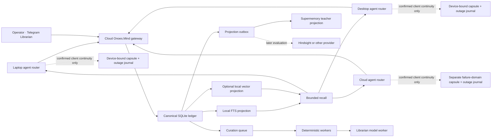
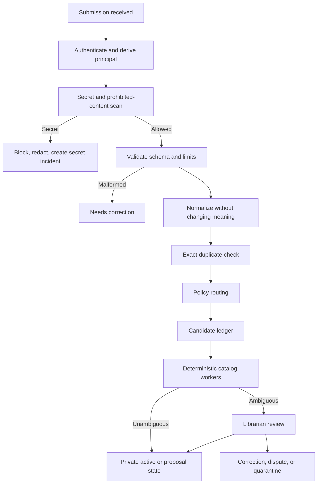

# Onoes.Mind — Durable Agent Memory Build Plan v4.2 DRAFT

**Document version:** 4.2 distributed-continuity reconciliation draft  
**Prepared:** 2026-09-02  
**Status:** Echo findings DC-01 through DC-15 reconciled; **draft for review—not build or deployment authorization**  
**Requested reviewer:** Echo, main build supervisor; follow-up review requested  
**Platform name:** `Onoes.Mind` is provisional  
**Stable agent IDs:** `tripp`, `echo`, `cyony`  

---

## 1. Executive decision

Proceed with the hybrid architecture established in Version 3 and hardened through v4.1, amended in this v4.2 draft for mandatory cloud-primary operation and bounded device continuity:

1. Host one operator-owned canonical memory ledger and policy gateway in the cloud as the mandatory primary memory for every agent.
2. Mechanically deny arbitrary Hermes/OpenClaw native semantic memory during healthy operation. Each device may use only its governed `agent-kernel`, bounded `continuity-cache`, and `outage-journal` under the continuity state machine.
3. Add an asynchronous Librarian service that catalogs already-sanitized, schema-valid candidates.
4. Evaluate Supermemory through a bounded free-tier shadow experiment as a behavioral teacher, not as the authoritative store.
5. Compare local behavior, Supermemory behavior, and multi-model review against one frozen evaluation corpus.
6. Adopt only behaviors that measurably improve quality, security, latency, or operator usefulness.
7. Never infer global outage, shared authority, or canonical durability from one client's inability to reach the cloud.

No external provider will possess the only copy of a durable record. Supermemory, Hindsight, and any future engine are replaceable projections behind the Onoes.Mind contract.

Onoes.Mind is not an optional memory tool. When healthy, it is the only dynamic semantic recall and canonical write path. Local continuity activates only through deterministic policy, remains non-canonical, and exits only through the recovery barrier.

> The Librarian organizes the library. It does not own the building, write the laws, or destroy books without authorization.

### Audit dispositions incorporated through version 0.3

The incoming audit returned `MODIFY`. This revision accepts its three architectural blockers and the required security mechanisms:

- Promotion now creates a shared record with explicit lineage and shadows the private source from normal recall; cross-scope recall collapses identical payloads by authority.
- Archive is a state, not a namespace. Candidate, record, and promotion behavior is defined through transition tables with authorized actors.
- One universal egress policy governs every external model prompt and provider projection, including the Librarian and evidence checker.
- Database constraints enforce one current revision, active-fact uniqueness, and idempotency instead of relying on tests alone.
- Write-path quotas, queue circuit breakers, source classification, mandatory out-of-band destructive confirmation, and a break-glass CLI are required.
- Restore requires a deletion ledger newer than the restored snapshot, and every export is encrypted.
- Evidence freshness, visibility, purge dependencies, transport, credential hashing, mandatory audit chaining, and FTS query construction are specified.

The subsequently supplied audit returned `APPROVE FOR SPECIFICATION` with Phase 0 conditions. Version 0.3 adds its useful deltas: recursive atomic secret scanning, immediate credential invalidation, protected sterile audit storage, SQLite-native concurrency controls, read-only failure posture, bounded projection retries, migration rehearsals, more granular latency metrics, operator revision diffs, and a fully answer-keyed evaluation corpus. Recommendations incompatible with the platform are not adopted: SQLite locking uses transactions and uniqueness constraints rather than unsupported `SELECT ... FOR UPDATE`, and Telegram auditing records authenticated Telegram/gateway identifiers rather than a source IP the Bot API does not reliably provide.

### Grok-4.5 v4 audit disposition for version 4.1

The final audit returned `MODIFY`. Several critical findings referenced mechanisms that version 0.3 did not contain—there was no soft-conflict auto-new-event-ID path, no runtime buffer claiming durable success, and no Telegram cooldown fallback. Version 4.1 nevertheless turns their absence into explicit prohibitions and adopts the valid interaction findings:

- Idempotency is universally first-write-wins, with an outcome-by-outcome event-binding table. Divergent retries never mint a new fact automatically.
- The initial runtime has no opaque local memory buffer. Success means canonical commit; future durable spill must use an explicit `durable=false` contract, pre-spill secret scanning, replay, and dead-letter behavior.
- Production destructive/shared mutations require a real second channel: a signed confirmation through the trusted local operator CLI. Telegram-only approval fails closed.
- Shared promotion and supersession use one fail-closed evidence gate, current-generation approval receipts, restricted writer paths, restore validation, and read-side evidence filtering.
- Deletion-ledger authenticity, environment binding, corruption handling, reconciliation summaries, and restore-blocking conditions are mechanical requirements.
- Storage pressure, retry coordination, sticky degraded alerts, and shared-mutation freezes cover the combined queue/disk/WAL failure mode.
- The tool contract is versioned and adapter-negotiated; correctness never depends on an LLM interpreting new status values.
- The original Phase A is split into core Phase A and operational-hardening Phase A.1.

### Echo distributed-continuity audit disposition for version 4.2

Echo returned `MODIFY` after reviewing cloud-primary use across a laptop, desktop, and cloud agent. Findings DC-01 through DC-15 are adopted in this draft. No finding is rejected. Implementation of outage journaling and capsule activation is deferred to its explicit Phase C gate; the governing contracts block Phase 0 completion.

The amendment makes Onoes.Mind mandatory while healthy, distinguishes a client partition from a globally observed service incident, defines three runtime states and a recovery barrier, and introduces device-bound Continuity Capsules. Supermemory remains optional and is not a dependency of compilation, outage operation, identity, deletion, or reconciliation.

| Echo finding | v4.2 classification | Implementation gate |
|---|---|---|
| DC-01 | Adopted | Phase C after Phase 0 router contract |
| DC-02 | Adopted | Phase C after Phase 0 measured breaker values |
| DC-03 | Adopted | Phase C client-partition tests |
| DC-04 | Adopted | Phase C capsule gate |
| DC-05 | Adopted | Phase 0 policy; Phase D quality gate |
| DC-06 | Adopted | Phase C kernel enforcement |
| DC-07 | Adopted | Explicitly disabled until Phase C durability gate |
| DC-08 | Adopted | Phase C reconciliation gate |
| DC-09 | Adopted | Phase A.1 controls and Phase C device gate |
| DC-10 | Adopted | Phase A.1 key controls and Phase C verification |
| DC-11 | Adopted | Phase 0 topology; production rollout gate |
| DC-12 | Adopted | Phase C compiler; Phase D adversarial evaluation |
| DC-13 | Adopted | Phase C fail-closed capsule states |
| DC-14 | Adopted | Phase C recovery barrier |
| DC-15 | Adopted | Phase 0 state policy; Phase C enforcement |

The separate reconciliation matrix provides current treatment, exact proposed treatment, sections, tests, and rationale for every row.

---

## 2. Goals

- Fast, bounded recall for Tripp, Echo, and Cyony.
- Credential-enforced private memories.
- Governed shared knowledge.
- Uniform, SQL-friendly memory submissions.
- Durable correction, supersession, deletion, export, and recovery.
- Evidence and provenance attached to every recalled record.
- Provider-neutral operation and exit paths.
- Model-assisted curation outside the latency-critical recall path.
- Direct operator control through a secured Telegram Librarian interface.
- Measured adoption of useful Supermemory behavior without vendor lock-in.

## 3. Non-goals for the first build

- A new vector database.
- A graph database.
- A general document/RAG platform.
- Automatic storage of every raw turn.
- An LLM on every read or write.
- Simultaneous live authority across several memory providers.
- A large dashboard.
- Automatic modification of executable skills.
- Autonomous hard deletion.
- Treating model agreement as fact verification.

---

## 4. Governing principles

1. **Repository and operator truth outrank memory.**
2. **Memory is evidence, not instruction and not truth by default.**
3. **Identity and scope are derived from credentials server-side.**
4. **The canonical ledger is operator-owned.**
5. **Search indexes and external providers are rebuildable projections.**
6. **Secret rejection occurs before durable content storage or external egress.**
7. **Corrections create lineage rather than silently rewriting history.**
8. **Agents propose shared knowledge; governed principals publish it.**
9. **Model judgment is replaceable, versioned, and auditable.**
10. **No provider becomes authoritative until isolation, deletion, restore, and poisoning tests pass.**

### Authority order

1. Current governed repository and files.
2. Current operator instruction.
3. Approved shared knowledge.
4. Agent-private durable memory.
5. Raw session history.
6. Model inference.

---

## 5. Target architecture



### Component responsibilities

| Component | Responsibility |
|---|---|
| Mandatory memory router | Enforces one runtime state and permits only the memory backend/actions allowed in that state |
| Runtime adapters | Cloud-primary bounded recall, clean capture envelopes, deliberate memory tools, continuity status, and v2 acknowledgement semantics |
| Intake gateway | Authentication, scope derivation, schema validation, secret controls, limits, policy routing |
| Canonical ledger | Records, revisions, evidence, state, promotion, audit, retention, tombstones |
| Deterministic workers | Normalization, exact dedupe, routing, retention scheduling, integrity checks |
| Librarian worker | Ambiguity review, near-duplicate suggestions, contradiction analysis, evidence requests, operator explanations |
| FTS/vector projections | Low-latency retrieval; always rebuildable from canonical content |
| Projection outbox | Atomic, idempotent, sanitized projection to external engines |
| Telegram Librarian | Operator review, approvals, alerts, reports, and natural-language administration |
| `agent-kernel` | Small, separately governed and signed identity/Soul artifact; immutable to runtime memory paths |
| `continuity-cache` | Read-only, signed, encrypted, bounded, expiring per-agent/per-device projection for confirmed continuity only |
| `outage-journal` | Local-only encrypted append log of non-canonical outage candidates awaiting governed replay |

---

## 5A. Mandatory cloud-primary distributed continuity

### Authority and failure-domain rule

The cloud gateway and canonical ledger are the only dynamic memory authority. A Continuity Capsule is a leased projection, not a replica, provider, or authority. An outage journal contains candidates, not accepted truth. No local condition grants shared-write, promotion, policy, credential, purge, or canonical-delete authority.

The cloud agent and Onoes.Mind must run in separate process and credential boundaries and should use separate host/zone failure domains where practical. Independent monitoring and encrypted backups/deletion-ledger replicas must not depend on the cloud agent or the primary Mind host. If both fail together, remaining devices may enter client continuity; canonical authority does not move.

### Mandatory router states

Each adapter has exactly one deterministic memory router. State is device-local, monotonic within a `continuity_epoch`, observable, and never chosen by an LLM.

| State | Permitted reads | Permitted writes | Explicit prohibitions |
|---|---|---|---|
| `MIND_PRIMARY_HEALTHY` | Cloud Onoes.Mind only; `agent-kernel` remains boot identity but local dynamic memory is denied | Canonical gateway only, using `memory_remember@2` | No native semantic recall, capsule recall, outage-journal append, or parallel local memory write |
| `CONFIRMED_OUTAGE_CONTINUITY` | Valid local `agent-kernel` plus valid device capsule, labeled with capsule generation/watermark/freshness and partition reason | Fsynced `outage-journal` candidates only; acknowledgement states local durability and `canonical=false` | No cloud-success claim, shared promotion/supersession, purge, policy/credential change, arbitrary native store, or capsule mutation |
| `RECOVERY_RECONCILIATION` | Capsule-only/restricted continuity until barrier completion; cloud reads only inside reconciliation machinery | Freeze ordinary local capture; replay journal through canonical intake with original event IDs | No mixing local and canonical recall, no deleting acknowledged-pending entries, no shared mutation, and no return to healthy before the barrier |

Every recall result carries `route`, `principal_id`, `device_id`, `continuity_epoch`, `health_epoch`, `capsule_version`, `canonical_watermark`, `fallback_reason`, and freshness label. Attempts to call a denied backend fail closed and create a sterile policy event. Arbitrary legacy/native semantic stores are disabled in all three states; the capsule subsystem is the only local semantic continuity path.

### Circuit breaker and outage classification

Phase 0 defines measured values for `failure_threshold`, `failure_window`, `probe_timeout`, `half_open_successes`, `stability_window`, `minimum_continuity_hold`, and `maximum_continuity_duration`. These values may differ by device/network class but are configuration, not model judgment.

Rules are deterministic:

1. A single error never enables continuity.
2. Authenticated success and a valid empty result prove reachability and reset eligible failure counters.
3. Rate limiting, request validation, authorization denial, secret rejection, application conflict, or valid empty recall do not count as outage evidence.
4. DNS failure, connection refusal/reset, transport timeout, TLS-path failure, and eligible gateway 5xx count only toward that client's reachability breaker. Authentication/certificate/policy-integrity failures enter a security lockout/fail-closed reason rather than ordinary continuity unless an operator-approved runbook says otherwise.
5. After threshold, the router records `client_partition` unless independent service monitoring supplies signed/corroborated evidence of `service_outage`. A client partition never implies global outage; other agents may continue canonical work.
6. Half-open probes are adapter-controlled and do not expose ordinary traffic. Failed probes return to continuity within the same epoch; successful probes must satisfy the complete stability window before recovery begins.
7. Maximum-duration or capsule-lease limits cause restricted identity-only/no-dynamic-recall behavior and an operator alert; they never silently extend local authority.

### Recovery reconciliation barrier

Connectivity alone does not restore healthy mode. The ordered barrier is:

1. Pass authenticated gateway health, policy-version compatibility, clock-skew, and integrity probes for the configured stability window.
2. Create a new recovery epoch and freeze ordinary outage-journal appends; correctness-critical agent work pauses or is explicitly labeled unavailable during the barrier.
3. Replay entries in journal sequence through normal scanning, authentication, scope derivation, and first-write-wins intake using their original event IDs.
4. Record one terminal reconciliation outcome per entry: `canonical_ack_same`, `closed_duplicate`, `idempotent_replay_divergence`, `correction_proposal_required`, `independent_claim_required`, `rejected_scope`, `rejected_secret`, or `dead_letter_operator_required`.
5. Never auto-mint a new event ID. Corrections and deliberate independent claims require an explicit governed action with a new linked event.
6. Retain journal content until canonical acknowledgement. After acknowledgement, retain only the minimum encrypted reconciliation receipt required by policy; unresolved correctness-critical entries block the barrier. Noncritical dead letters require an explicit operator policy/receipt before healthy mode may resume.
7. Compile, deliver, verify, and atomically install a fresh capsule at a canonical watermark at least as new as the completed replay.
8. Advance the router to `MIND_PRIMARY_HEALTHY`, disable capsule recall/journal writes, and emit a sanitized recovery receipt.

If replay, conflict handling, fresh compilation, acknowledgement, or installation fails, the router remains in recovery or enters restricted mode. It never mixes the stale capsule with live canonical recall.

### Continuity artifact separation

The three local artifacts have separate schemas, keys, files/stores, owners, and mutation paths:

| Artifact | Authority and writer | Contents | Runtime behavior |
|---|---|---|---|
| `agent-kernel` | Human operator/governed identity publisher only | Stable identity, role, non-secret boundaries, offline conduct, trusted endpoint/key identifiers | Signed separately, immutable at runtime, available for boot/restricted identity-only mode |
| `continuity-cache` | Cloud capsule compiler only | Selected current canonical content plus local FTS and traceability metadata | Read-only; installed A/B atomically; never accepts local writes |
| `outage-journal` | Local adapter in confirmed continuity only | Sanitized candidate envelopes and replay state | Append-only/fsynced; never queried as accepted memory and never mutates kernel/cache |

Soul/identity changes require explicit human approval and a new signed kernel revision. Candidate capture, model output, summaries, imports, prompt content, capsule compilation, or outage replay cannot modify the kernel. A replacement kernel must pass signature, device/principal binding, version monotonicity, and rollback policy before atomic activation.

### Continuity Capsule contract

A capsule is built separately for each `(environment_id, principal_id, device_id)`. Its signed manifest includes:

```text
capsule_id
capsule_version
environment_id
principal_id
device_id
compiler_id
compiler_version
selection_policy_version
schema_version
canonical_watermark
generated_at
not_before
expires_at
revocation_epoch
kernel_version_required
record_revision_ids_and_hashes
bucket_counts_and_bytes
fts_index_hash
content_root_hash
encryption_key_id
signing_key_id
signature
```

Content is a controlled mixture:

- Exact/full content only for small operator-pinned, identity-adjacent, active commitment, or operationally necessary records where wording matters.
- Compact summaries for broader active-project/recent context, each bound to canonical record/revision IDs, hashes, summary policy/model version, and freshness.
- Metadata/evidence pointers for traceability; no inaccessible evidence content.
- A local FTS index only over content actually present and permitted in the capsule.

Never include raw transcripts, secrets/credentials, quarantined/disputed/purged/forgotten/expired records, superseded history except an explicitly necessary current-state note, large evidence bodies, executable skills, unrestricted database history, another principal's private scope, or instructions derived from untrusted memory.

For the Phase 0 evaluation harness only, use provisional ceilings of a **32 MiB encrypted capsule**, **1,500 selected records/summaries**, **32 KiB kernel**, **20 explicit offline-search results**, and **700 automatic-injection tokens per turn**. These are test bounds, not production guesses. Reserved bucket caps prevent a busy project from evicting identity/pinned/commitment material. Production byte/item/TTL limits remain unset and block rollout until corpus/device measurements and explicit operator approval; any later increase requires a documented security/performance review rather than silent tuning.

### Deterministic compiler policy and receipts

Compilation reads only current canonical records returned by server-side authorization for the target stable IDs. It never joins on display names, content-supplied agent/project labels, or a stale projection.

Selection proceeds in this order:

1. Exclude by scope, sensitivity, state, revocation, retention, expiry, evidence/contradiction status, device policy, and offline usefulness.
2. Reserve bounded buckets for kernel references/operator pins, active commitments, active projects, recent summaries, and high-utility durable facts.
3. Within a bucket, order by operator pin, authority, current validity, safety/evidence status, commitment/project relevance, freshness, offline usefulness, and byte cost.
4. Recall frequency may contribute only a bounded tie-breaker and can never override authority, current status, contradiction, safety, scope, expiry, or an authoritative correction.
5. Produce an inclusion/exclusion receipt containing stable IDs, source revision/hash, inclusion reason, scope/sensitivity decision, bucket, byte cost, and compiler/policy version. Receipts contain no unauthorized content.
6. Size-check, build FTS, sign, encrypt, deliver to an inactive slot, verify locally, and atomically activate; retain the prior valid slot for bounded rollback.

Compilation and installation fail closed on scope ambiguity, unsupported policy, missing classification, hash mismatch, size overflow, or signature/encryption failure.

### Device cryptography, lease, revocation, and loss

- Capsule confidentiality uses authenticated encryption to a per-device key and binds associated data to environment, principal, device, version, watermark, and expiry. Capsule signing and encryption use separate key roles.
- Device keys are never shared across devices or principals; private keys are OS-protected and hardware-backed where available. Phase 0 defines enrollment, attestation expectations, rotation, backup/recovery, and destruction.
- Anti-rollback state rejects old capsule/kernel versions and lower revocation epochs even when signatures are valid.
- Each capsule is a time-bounded offline lease. Its expiry and optional shorter sensitivity-class TTL bound the unavoidable exposure window when a device cannot receive deletion/revocation updates.
- Cloud device registration tracks key version, principal binding, grant epoch, last renewal, status, and loss/revocation reason. Lost/stolen devices are revoked, stop receiving capsules, and receive remote wipe where the platform supports it; remote wipe is defense-in-depth, not a guarantee.
- A device unable to prove a current lease may use only a valid kernel in restricted identity-only mode. Expired, revoked, signature-invalid, decrypt-failed, policy-incompatible, wrong-device, wrong-agent, wrong-environment, or downgrade capsules provide no dynamic recall.
- On reconnection, revocation/deletion/grant deltas are processed before any capsule renewal or recovery. Purged/revoked content is excluded from the fresh capsule and removed from active/rollback slots according to the deletion policy.

The operator chooses capsule/record-class TTLs based on acceptable stolen/offline exposure versus outage usefulness; the system cannot guarantee remote deletion from a device that never reconnects. This limitation is explicit, measured, and bounded by encryption, key protection, expiry, and minimal selection.

### Outage journal contract

The journal is encrypted, append-only, checksummed/chained, bounded, and fsynced before returning `accepted_outage_local`. The response includes `durable_local=true`, `canonical=false`, `event_bound_local=true`, event ID, device ID, continuity epoch, journal sequence, and capsule watermark. It must never be reported as canonical memory.

Each entry contains the sanitized candidate, original event ID created before the first local append, source class `outage_fallback`, observed time, device/principal/environment IDs, continuity and health epochs, capsule watermark, local classification/scanner versions, sequence/hash, replay attempts, reconciliation outcome, and dead-letter state. Secrets/prohibited content are rejected before append using the pinned scanner; overflow or disk failure returns a visible failure and never claims durability.

Journal entries cannot be recalled as active facts, modify the capsule/kernel, or request shared authority. Replay respects global/per-principal budgets and preserves journal order where causal relationships require it. Crash/reboot recovery verifies the chain and resumes without duplicate canonical facts.

### Capsule validity states

| Capsule state | Behavior |
|---|---|
| `valid` | Eligible only in confirmed continuity |
| `nearing_expiry` | Eligible with freshness warning; aggressively probe/notify but do not bypass circuit rules |
| `expired` or `revoked` | No dynamic recall; restricted kernel-only mode |
| `signature_invalid`, `decrypt_failed`, `wrong_binding`, `policy_incompatible`, `rollback_detected` | Fail closed, quarantine artifact, alert; do not fall back to another arbitrary native store |
| `rollback_available` | Prior slot may activate only if still valid, not revoked, binding-correct, and allowed by monotonic rollback policy |

All continuity recall labels the canonical watermark and age. Potentially stale permissions, commitments, and rapidly changing facts use shorter TTLs or are excluded entirely.

---

## 6. Identity, scopes, and permissions

Stable identity is independent of credentials and product branding:

```text
credential -> principal -> policy grants -> stable scopes
```

Credential rotation changes the credential, not the principal or its memory history.

### Initial scopes

```text
agent/tripp/private
agent/echo/private
agent/cyony/private
project/onoes-mind/shared
shared/knowledge
quarantine/untrusted
```

Archive and supersession are record states. Records never move to a synthetic archive scope, because changing scope would change fact identity and complicate authorization and promotion lineage.

### Access matrix

| Principal | Own private | Other private | Project/shared read | Shared publish | Quarantine | Purge |
|---|---:|---:|---:|---:|---:|---:|
| Tripp | Read/write candidate | No | Yes | Propose only | No | No |
| Echo | Read/write candidate | No | Yes | Propose only | No | No |
| Cyony | Read/write candidate | No | Yes | Propose only | No | No |
| Librarian worker | Only through approved model-routing policy | No blanket access | Prepare proposals | No | Metadata/assigned items only | No |
| Operator | Yes | Yes | Yes | Approve/publish | Review | Confirmed operator action |

No API request may select an arbitrary private scope. Caller-supplied identity and scope fields are hints only.

---

## 7. Uniform submission contract

All agents submit the same candidate envelope:

```json
{
  "event_id": "evt_01...",
  "kind": "project_fact",
  "claim": "Onoes.Mind uses SQLite as its canonical ledger.",
  "project_id": "onoes-mind",
  "requested_visibility": "private",
  "observed_at": "2026-08-02T18:00:00Z",
  "source_class": "repository",
  "evidence_refs": [
    {
      "type": "repository",
      "ref": "docs/architecture.md",
      "content_hash": "sha256:..."
    }
  ],
  "supersedes": null,
  "retention_class": "project_lifetime"
}
```

The gateway adds authoritative fields such as `principal_id`, permitted scope, verified `source_class`, sensitivity classification, receipt time, and policy version. `source_class` is derived from authenticated capture context and evidence, not trusted merely because the submitter supplied the string. Initial classes are `operator_direct`, `repository`, `governed_file`, `tool_output`, `conversation`, `external_untrusted`, `outage_fallback`, and `legacy_import`. The gateway assigns `outage_fallback` only after validating device, epoch, journal, and replay metadata.

Submitter confidence is excluded from routing, trust, and acceptance. A manipulated agent can be highly confident about a poisoned claim; provenance and evidence are the relevant signals.

### Canonicalization

Canonicalization must be versioned and define:

- UTF-8 encoding.
- Unicode normalization.
- Newline normalization.
- Whitespace policy.
- Stable structured-data serialization.
- Case-preservation rules.
- Canonicalization version.

Use separate identities:

```text
payload_hash = SHA-256(canonicalization_version || normalized_content)
active_fact_identity = scope_id || kind || payload_hash
idempotency_key = stable submission/projection event ID
```

Do not include `agent_id` in fact equality. Independent submissions of the same shared fact should attach multiple evidence observations to one canonical claim.

### Idempotency contract

The submitting adapter generates a UUID/ULID `event_id` before its first attempt and reuses it unchanged for transport retries. Binding is universally first-write-wins:

- Same principal, same event ID, same canonical payload: return the original result.
- Same principal, same event ID, different canonical payload after a durable bind: return `idempotent_replay_divergence` with the original event/record identifiers and sanitized hash; keep the original and create nothing.
- A gateway-generated correlation ID is separate and does not replace client idempotency.

On divergence, the adapter surfaces the original record and does not generate a replacement event ID. A changed intent must use `memory_correct` with a new event ID and an explicit supersession link; a deliberate independent claim uses `memory_remember` with a new event ID. No automatic `override_event_id` exists. Any future administrative override is restricted to non-binding outcomes, separately authorized, rate-limited, and audited.

#### Submission-event binding state machine

| Gateway outcome | Event ID bound? | Durable content retained? | Required retry/correction behavior |
|---|---:|---:|---|
| `accepted`, `processing`, `closed_duplicate` | Yes | Sanitized content or canonical pointer | Same event ID returns original; mismatch returns divergence and creates nothing |
| `needs_correction` | Yes, to sanitized outcome only | No rejected body/transformation | Corrected submission uses a new event ID linked to the prior event |
| `rejected_secret` / prohibited content | Yes, to sanitized outcome only | No content or secret-derived payload hash; only incident ID/category | Same event ID returns original sanitized rejection; corrected submission uses a new linked event ID |
| `queue_full`, `storage_pressure`, gateway unavailable/503 | No | No | Retry the same event ID; minting another ID is forbidden |
| `rate_limited` | No | No | Retry the same event ID after the governed delay |

An event becomes bound only in a committed transaction. A client timeout never changes the binding rules. Divergence responses are content-independent in shape and bounded in timing where practical to reduce event-ID probing.

### Required database invariants

Phase A migrations must enforce, at minimum:

```sql
CREATE UNIQUE INDEX one_current_revision
  ON memory_revisions(record_id)
  WHERE is_current = 1;

CREATE UNIQUE INDEX unique_submission_event
  ON submission_events(principal_id, event_id);

CREATE UNIQUE INDEX unique_active_fact
  ON memory_records(scope_id, kind, payload_hash)
  WHERE state IN ('active', 'promoted');
```

Equivalent constraints may be used if the final schema names differ. Supersession and current-revision changes occur in one transaction. Concurrent losers receive a conflict/retry result rather than producing two current truths.

---

## 8. Intake and curation flow



### Deterministic worker duties

- Credential-to-principal resolution.
- Schema validation.
- Unicode and timestamp normalization.
- Project and record-type ID resolution.
- Secret and prohibited-data scanning.
- Exact duplicate detection.
- Retention assignment from policy.
- Routing to private candidate, shared proposal, correction, or quarantine.
- Integrity and projection reconciliation.

### Write-path limits

Writes receive the same defensive attention as reads. Initial limits are configurable and finalized from Phase 0 volume assumptions:

- Maximum canonical claim size: 8 KiB.
- Maximum complete submission envelope: 32 KiB.
- Maximum evidence references: 20.
- Per-principal token-bucket rate limits and daily quotas.
- Per-turn capture cap.
- Global and per-principal pending-queue limits.
- Admission control considers queue depth, free disk percentage/bytes, WAL size/growth, writer transaction latency, and deletion/audit control-plane health—not queue depth alone.
- At soft pressure, pause nonessential Librarian, projection, integrity, and archive work. At the hard waterline, reject writes as unbound `queue_full` or `storage_pressure`, preserve bounded recall where safe, freeze all shared-knowledge mutations, and emit one sticky degraded-state alert.
- HTTP/tool responses distinguish `accepted`, `processing`, `needs_correction`, `rate_limited`, `queue_full`, `storage_pressure`, and `rejected`; each declares whether the event is bound and whether content is durable.
- Recovery uses token-drip slow start. Adapters honor `Retry-After` with full/decorrelated jitter, a stable principal-specific slot, and per-principal plus global retry budgets; retries never bypass intake quotas.

Phase 0 must state expected daily candidate volume. The design target is that at least 90% of accepted candidates resolve deterministically; no more than 10% should require a Librarian model call under normal operation.

### Runtime acknowledgement and buffering contract

In healthy mode, the initial production adapter does not persist or silently buffer raw `memory_remember` arguments. It returns success only after a canonical commit. Gateway-unavailable, `queue_full`, `rate_limited`, and `storage_pressure` responses mean **not remembered** and retain the same event ID for a later retry. The separately specified outage journal is not a transparent retry buffer: it activates only in `CONFIRMED_OUTAGE_CONTINUITY`, reports local/non-canonical durability explicitly, and follows the recovery barrier.

If a later runtime adds a local L1 spill buffer, it is a separately gated Phase C feature with all of these requirements:

- Response is `accepted_local_buffer` with `buffer_item_id`, `durable=false`, and `not_in_canonical=true`; it is never reported as remembered.
- The exact version-pinned gateway scanner library runs before disk spill. Unvalidated raw tool arguments never reach durable media, logs, crash reports, or retry queues.
- The spill is separate from the canonical database, append-only/checksummed, fsynced on enqueue, encrypted at rest, bounded, and replayed on restart using the original event ID.
- Overflow or disk-full fails visibly as `buffer_full`; retry exhaustion moves the item to a local dead-letter state and alerts without deletion.
- A later gateway `secret_detected` response purges the corresponding spill item and initiates incident handling.
- Buffer health is exposed from adapter-local state or external metrics, never written through the already-contended canonical writer.

### Librarian duties

- Explain filing and policy decisions.
- Suggest near-duplicate merges.
- Identify contradictions.
- Request missing evidence.
- Check cited repository evidence.
- Propose supersession.
- Prepare shared promotion reviews.
- Summarize stale candidates and integrity results.
- Coordinate high-risk second-model critique where configured.

### Universal model and provider egress policy

Every payload leaving the trusted gateway—whether to the Librarian, a second reviewer, an evidence-checking model, Supermemory, Hindsight, or another provider—uses one common egress service:

1. Resolve the destination endpoint from a governed registry.
2. Check that the endpoint is approved for the record's scope, sensitivity, source class, and purpose.
3. Normalize and rescan the exact outbound payload.
4. Redact or deny fields not required for the task.
5. Apply destination-specific payload and retention limits.
6. Record a sanitized egress audit event and correlation ID, including model endpoint, model version, prompt-template hash, and policy version but no memory content.
7. Rescan and frame the response as untrusted before it re-enters the system.

Private content is denied to external model endpoints by default. An endpoint may receive private content only through explicit operator policy naming the provider, model, allowed scope/sensitivity classes, purpose, retention posture, and expiry of the grant. Sensitive content remains local unless a separate explicit decision authorizes otherwise.

Model views follow data minimization: use typed fields, opaque identifiers, and pseudonymized/redacted excerpts whenever the curation task permits. Exact content is provided only when necessary and only to an endpoint explicitly approved for that scope and sensitivity. A pinned local model is the preferred option for private curation if it meets the frozen-corpus quality gate; provider outage or model mismatch degrades to deterministic processing/operator review rather than silently switching to a less-trusted endpoint.

Evidence fetched from repositories or tools is scanned before it enters any model prompt. The Librarian never receives raw candidates merely because it is an internal system role.

### Librarian prohibitions

- No direct permission changes.
- No automatic publication of shared truth.
- No blanket cross-private search.
- No trust elevation based on model agreement or recall frequency.
- No silent rewriting of claim meaning.
- No direct modification of executable skills.
- No autonomous hard deletion.
- No requirement on the synchronous recall path.

---

## 9. Candidate, memory, promotion, and deletion states

### Candidate lifecycle

Archive, quarantine, dispute, and supersession are states or review conditions, never scopes. Every transition records actor, reason, policy version, time, and prior/new state.

| From | To | Authorized actor | Rule |
|---|---|---|---|
| `submitted` | `needs_correction` | Gateway | Envelope or deterministic validation fails; return machine-readable corrections |
| `submitted` | `ready_for_catalog` | Gateway | Schema, policy, secret, scope, and source checks pass |
| `needs_correction` | `submitted` | Original principal | Corrected submission uses a new event ID and links to the rejected event |
| `needs_correction` | `stale_pending_archive` | Scheduler | Correction deadline expires under the candidate retention policy |
| `stale_pending_archive` | `submitted` | Original principal/operator | Corrected before final archival |
| `stale_pending_archive` | `archived` | Scheduler/operator | Grace period expires or operator confirms |
| `ready_for_catalog` | `accepted_private` | Deterministic worker | New valid fact is committed to the submitter-private scope |
| `ready_for_catalog` | `closed_duplicate` | Deterministic worker | Exact active fact exists; attach provenance/evidence without creating another fact |
| `ready_for_catalog` | `disputed` | Policy worker/operator | Evidence conflicts with an existing fact; no active truth changes automatically |
| `ready_for_catalog` | `quarantined` | Policy worker/operator | Structural safety, poisoning, or authorization concern |
| `disputed` | `ready_for_catalog` | Operator/evidence revalidation | Conflict resolved with an auditable rationale |
| `disputed` | `archived` | Operator | Claim rejected or expires unresolved |
| `quarantined` | `ready_for_catalog` | Operator only | Explicit rehabilitation after safety review |
| `quarantined` | `purged` | Operator only | Confirmation-gated hard deletion |
| `accepted_private` | `proposed_shared` | Authorized principal/Librarian | Proposal only; no visibility expansion yet |
| `proposed_shared` | `promoted` | Human operator by default; explicitly delegated approver only after Phase E decision | Promotion-copy transaction completes |
| `proposed_shared` | `accepted_private` | Operator/authorized approver | Rejected with reason; private record remains active |

Promotion requests are consolidated by `(target_scope, payload_hash)` while pending. Concurrent proposers and evidence attach to one request instead of creating review spam.

### Durable record lifecycle

| From | To | Authorized actor | Rule |
|---|---|---|---|
| `active` | `superseded` | Deterministic correction transaction | A new current revision takes its place; private corrections may auto-apply, shared corrections require approval |
| `active` | `promoted` | Promotion transaction | Private source remains as lineage/evidence but leaves normal private recall |
| `active` | `forgotten` | Owning principal/operator | Recoverable recall suppression; it is not purge |
| `forgotten` | `active` | Owning principal/operator | Restore within the retention window |
| `active`, `superseded`, `promoted`, `forgotten` | `archived` | Retention scheduler/operator | In-place archival with scope unchanged |
| `archived` | `active` | Operator | Restore with an audit reason if not purged |
| Any non-purged state | `purged` | Operator only | Destructive confirmation, evidence-dependency check, projection deletion, and deletion-ledger entry |

### Promotion lifecycle

Promotion is a copy-with-lineage operation, not an in-place scope mutation:

```text
private active record
  -> consolidated promotion proposal
  -> evidence and visibility validation
  -> reject: private record remains active
  -> approve: create shared record + mark private source promoted
```

Promotion events record:

- Proposal and source revision IDs.
- Proposer and proposal time.
- Target scope.
- Evidence references and rationale.
- Decision, decider, decision time, and reason.
- Published shared revision ID.

The shared record stores `promoted_from_record_id` and `promoted_from_revision_id`. The private source stays available for authorized provenance/history but is excluded from normal recall after approval. Cross-scope retrieval collapses identical `payload_hash` values and prefers the highest-authority permitted current record, so approval cannot surface both private and shared copies. A shared claim may not rely solely on evidence that intended shared readers cannot access.

### Fail-closed shared evidence gate

All shared promotion and shared supersession paths call one transaction module; the REST/MCP gateway, Telegram, local CLI, imports, migrations, and restore tooling have no alternate publication path. Direct database access is operationally restricted to the gateway writer and offline recovery procedures.

Scope/sensitivity uses a total restrictive order for gate comparison: `public < internal_shared < project_restricted < agent_private < sensitive_local < prohibited`. Missing/unknown classification is more restrictive than every publishable target and fails closed. A shared revision may reference only evidence visible to its entire target audience or a shareable attestation derived under policy.

Mechanically:

- A proposal freezes evidence revision IDs, hashes, classifications, and a `proposal_generation`.
- Adding/removing/reclassifying evidence or changing its verification status increments the generation and invalidates prior approval tokens.
- Approval re-runs the gate inside the publishing transaction against the union of all consolidated-proposal evidence; cached validity is only a hint.
- SQLite triggers/state constraints require a current gate receipt for the exact proposal generation before a record can enter a shared-active state. The same condition applies to shared corrections and legacy/emergency imports.
- Evidence marked `changed`, inaccessible, `NULL`-classified, or hash-mismatched blocks approval until resolved.
- `memory_source` filters private lineage/evidence for shared readers; they receive only permitted shareable attestations.
- Restore runs an offline shared-evidence validation before serving reads. Violations remain blocked/quarantined and are never auto-published.
- Force-promotion is disabled by default. Enabling it requires the local second channel, dual-control policy, a CRITICAL audit event, and an explicit exception record.

Phase A lands classification fields and the pure gate evaluator. The publication workflow, trigger/receipt enforcement, and destructive/shared operator interface ship together in Phase E so the gate cannot become untested dead code.

### Hard deletion policy

Hard purge removes content, evidence payload, FTS/vector rows, caches, and external projections. Evidence dependencies are checked first: purge is held or accompanied by an explicit warning and dependent-claim disposition. It retains only an opaque non-content tombstone when policy permits so lineage and deletion reconciliation remain valid. Purge is operator-only and confirmation-gated.

---

## 10. Conceptual canonical schema

The first schema should include these logical tables:

| Table | Purpose |
|---|---|
| `principals` | Stable agents, operator, services |
| `credentials` | Rotatable credentials mapped to principals |
| `scope_grants` | Read/write/propose/approve permissions |
| `submission_events` | Sanitized intake envelopes and outcomes |
| `memory_records` | Stable logical records and current state |
| `memory_revisions` | Append-only content revisions and time semantics |
| `evidence_refs` | Sources supporting or disputing claims |
| `submission_transformations` | Versioned normalization diffs |
| `promotion_requests` | Shared-knowledge workflow |
| `review_queue` | Operator correction, dispute, and quarantine work |
| `retention_jobs` | Archive and purge scheduling |
| `audit_events` | Sanitized security and lifecycle events |
| `projection_outbox` | Atomic external/index projection jobs |
| `projection_state` | Canonical-to-provider ID and reconciliation state |
| `model_endpoints` | Approved model/provider identities, trust zones, and data classes |
| `egress_policies` | Scope/sensitivity rules governing all model and provider calls |
| `deletion_tombstones` | Minimal in-database purge markers |
| `secret_incidents` | Non-secret fingerprints and remediation metadata |

### Time fields

Distinguish:

- `observed_at`: when the event was observed.
- `valid_from` / `valid_to`: when the fact is considered true.
- `received_at`: gateway receipt.
- `created_at`: canonical insertion.
- `revised_at`: revision creation.
- `projected_at`: provider/index projection.

### Embedding projection metadata

Store outside the canonical fact body:

- Provider and model.
- Model revision/version.
- Output dimension.
- Normalized-input hash.
- Projection version and status.
- Last verified and last error times.

### Evidence integrity and visibility

Each evidence reference stores evidence type, scope/sensitivity, immutable locator/provenance, `evidence_hash`, `verification_status`, `last_verified_at`, and verifier/policy version. A typed evidence reference may point to an external source, governed file, content-addressed encrypted blob, or a specific memory record revision; record evidence always binds the revision ID and content hash rather than a mutable current-record pointer. Large evidence payloads are not copied into the claim row. Phase 0 defines which evidence classes are reference-only, snapshotted into encrypted blob storage, or prohibited. Repository and governed-file evidence is reverified periodically and on relevant repository/file events. A hash mismatch degrades the evidence to `changed` and queues review; it does not automatically dispute or replace the claim.

Evidence retrieval follows the same scope and sensitivity checks as memory retrieval. Shared claims require at least one evidence path visible to the shared audience or a separately approved shareable attestation. Evidence-checking model calls pass through the universal egress service. Purge checks dependent claims and applies a hold or records the operator's explicit dependency decision.

### Transport, credentials, and audit integrity

- Store credential verifiers as salted password hashes or keyed token hashes; raw bearer tokens are issued once and are never reversibly stored.
- Give each principal a credential epoch/rotation timestamp. Every request validates the credential version against authoritative revocation state; rotation atomically advances the epoch and actively evicts any authentication cache entry so the old credential stops working immediately.
- Prefer loopback or a local named pipe for co-hosted components. Cross-host traffic uses a private overlay plus authenticated TLS/mTLS. The gateway is never directly public.
- The tamper-evident audit chain is mandatory from Phase A. Each serialized audit event carries an HMAC over the previous chain value and sanitized event fields; keys are separated from database contents and rotated by policy.
- Audit records are sterile metadata only: no claims, evidence payloads/titles, prompts, credentials, or request/response bodies. They live in an operator-only append path protected by host/database encryption at rest, separate access controls, retention policy, and HMAC-chain verification.
- The deletion ledger is an independently backed-up, append-only, non-content control. Its signed header binds `environment_id`, ledger format/version, chain root, and key ID. Every monotonically sequenced entry contains the prior-chain value, tombstone ID, opaque record fingerprint, purge time, scope class, and reconciliation status plus a separated-key HMAC. It is not merely a table restored from the same older snapshot it must police.
- Only the purge transaction may append ledger entries, under the same local second-channel confirmation. Per-operation item caps and hourly purge budgets limit accidental or malicious floods. Ledger/audit/pressure health is emitted through a writer-independent heartbeat/metrics path so a failed canonical writer cannot hide control-plane failure.

### SQLite concurrency mechanism

Use WAL mode, short explicit write transactions, one authoritative writer queue, a configured busy timeout, and bounded jittered retry for `SQLITE_BUSY`. Dedupe and revision creation rely on the database uniqueness constraints, with conflict-aware `INSERT ... ON CONFLICT`/UPSERT logic that verifies the existing payload and returns the correct original/conflict result. Reader connections use `PRAGMA query_only=ON`. SQLite does not provide the row-locking semantics implied by `SELECT ... FOR UPDATE`; correctness comes from transaction boundaries, constraints, and retry behavior.

---

## 11. Secret handling

If an API key appears unexpectedly, treat it as compromised.

1. Recursively scan the complete decoded envelope—including claims, nested structured fields, evidence locators, URLs, headers, and attachments—before durable content storage, journaling, hashing, embedding, retry queuing, or external projection. Reject malformed/ambiguous encodings before scanning can be bypassed.
2. Compute a keyed fingerprint:

   ```text
   HMAC-SHA-256(secret_fingerprint_key, raw_secret)
   ```

3. Create a non-secret incident ID and metadata record.
4. Atomically replace every detected occurrence in the volatile response/incident workflow with a redaction reference; if any field cannot be safely transformed, reject the entire envelope.
5. Block canonical memory insertion and external projection.
6. Notify the operator without displaying the secret.
7. Revoke/rotate, search affected surfaces, and verify purge.

Example safe incident:

```json
{
  "secret_incident_id": "secinc_01...",
  "provider_guess": "openai",
  "fingerprint": "fp_v1_7H2K4Q9D31ZR",
  "detected_from_principal": "cyony",
  "status": "rotation_required",
  "canonical_storage": "blocked",
  "external_projection": "blocked"
}
```

The scanner may track exact spans only in process while verifying complete redaction; span positions are not stored because they can aid reconstruction. For blocked or rejected content, neither the raw candidate nor its transformed/redacted body is retained; only the non-secret incident/result record and sanitized audit metadata survive. The raw secret must never appear in memory content, FTS/vector indexes, logs, traces, Telegram, retry queues, model prompts, or external providers.

Logging uses an allowlist of sanitized fields. Reverse proxies, crash reporting, traces, and debug modes must not capture bodies or authorization headers.

This boundary covers the memory platform, its calls, and its managed projections. It cannot guarantee removal from an agent runtime transcript that captured a key before invoking memory; runtime transcript/log controls and credential rotation remain separate mandatory incident actions. Detection of fragmented or encoded secrets is best-effort and is backed by payload caps, entropy/pattern scanning, egress scans, and the acceptance suite.

---

## 12. Retrieval policy

### Initial local retrieval

Phase A begins with FTS5 only:

1. Derive permitted scopes from the principal.
2. Apply status, scope, trust, sensitivity, and project filters.
3. Convert user text into a bounded token list, quote/escape permitted terms, and construct the FTS expression internally; never interpolate raw query syntax.
4. Collapse equal `payload_hash` records across permitted scopes, preferring the highest-authority current record and then the freshest valid revision.
5. Fit item and token budgets.
6. Return labeled evidence records.
7. Record shown IDs separately from trust.

Later semantic retrieval may add a local vector projection and measured hybrid fusion. Vectors are not authoritative.

### Defaults to validate

| Parameter | Initial planning value |
|---|---:|
| Automatic recall candidates | 8 |
| Automatically injected | 3–5 |
| Normal token cap | 700 |
| Explicit deep-search cap | 1,200 |
| Local soft target | 100 ms |
| Local cancellation deadline | Approximately 300 ms plus small enforcement headroom |
| Deep-search hard result cap | 20 |

SQLite queries run in worker threads/connections. A progress handler with a monotonic deadline and `sqlite3_interrupt` enforces cancellation. Query length, term count, prefix use, payload size, and result count are bounded.

Budgets are per authorized request after scope filtering: automatic recall uses the smaller item/token/deadline limits, while explicit `memory_search` may use the deep-search limits. Per-principal concurrency and aggregate rate limits still apply. Prepared statements, maximum token length, maximum term count, and restricted wildcard/prefix behavior accompany `PRAGMA query_only=ON` on retrieval connections.

Recalled content is framed as historical evidence with record ID, scope, source, time, status, and trust. It is never inserted as executable instruction text.

---

## 13. Phase A agent interface

### Initial MCP tools

| Tool | Purpose |
|---|---|
| `memory_search` | Deliberate search across permitted scopes |
| `memory_remember` | Submit a structured candidate |
| `memory_correct` | Propose a superseding revision |
| `memory_forget` | Request forget or operator-governed purge |
| `memory_source` | Retrieve permitted provenance and evidence |
| `memory_status` | Health/degraded state, plus per-event processing result and SLA status when given an authorized event ID |

Automatic recall uses the same gateway query core in bounded recall mode and does not require a model-callable `memory_recall` tool.

### Versioned tool contract and acknowledgement

The first production write contract is `memory_remember@2`; adapters negotiate the schema during connection and own status handling. Every response includes `contract_version`, `status`, `event_id`, `event_bound`, `durable`, `retryable`, and—when permitted—canonical/result identifiers. The LLM is never responsible for interpreting resolution enums correctly.

- `durable=true` means the canonical commit exists or the response points to its prior committed result.
- `durable=false` never means remembered.
- Divergence returns the original result plus a warning; the adapter never retries under a new event ID.
- Unbound overload/unavailability is a retryable transport result using the same event ID.
- A runtime that cannot negotiate v2 may search/recall in a compatible read-only mode but cannot use a production write path. No ambiguous mapping to legacy binary success is allowed.

Phase C includes pinned OpenClaw and Hermes contract fixtures and blocks production writes until both acknowledgement and retry behavior pass. Adapter instructions are fixed: **transport retry = same event ID; changed intent = `memory_correct`; deliberate independent claim = new `memory_remember`.**

### Deferred interfaces

- `memory_propose` — governance phase.
- `memory_handoff` — governance phase.
- Export — operator CLI/API only.
- Review queue — operator Telegram/CLI/API only.
- `memory_diff` — operator CLI/API command that compares two authorized revisions using sanitized field-level and text diffs; it is not initially exposed as an agent tool.

---

## 14. Telegram Librarian

The Telegram Librarian is an authenticated operator interface to the gateway, not a database owner.

### Candidate commands

```text
/status
/review
/conflicts
/quarantine
/archive
/retention
/approve <proposal>
/reject <proposal>
/restore <record>
/forget <record>
/source <record>
/diff <record> <revision-a> <revision-b>
/integrity
/backups
/projections
/supermemory
/cost
```

### Security controls

- Allowlisted immutable Telegram account IDs.
- Use a dedicated operator bot identity and credential set, separate from all agent and provider credentials.
- No authorization by username/display name.
- Read-only versus destructive command separation.
- Low-impact actions may use short-lived Telegram confirmation tokens/buttons. Shared promotion/supersession, purge, credential changes, policy changes, force operations, and bulk decisions may not.
- No raw quarantined content or secrets in messages by default.
- Audit every command.
- Record Telegram update ID, immutable account/chat ID, command ID, gateway receipt time, confirmation-channel event ID, and result. Do not claim a caller source IP that Telegram's Bot API does not reliably expose.
- Rate limiting and safe behavior during Telegram outage or compromise.
- Bound pending destructive requests per operator/session and expire them quickly.
- Production second-channel choice is fixed: Telegram creates a short-lived challenge, and the human operator must run `onoes ops confirm <challenge>` on the trusted local administration host. The CLI signs the challenge with an OS-protected operator key (hardware-backed when available). Shared promotion/supersession, purge, credential/policy changes, force operations, and bulk actions fail closed if this channel or key is unavailable. No Telegram cooldown/button fallback exists in production.
- Telegram enrollment occurs only through the local operator CLI using immutable account ID verification; there is no trust-on-first-use enrollment.
- A local break-glass CLI can revoke Telegram access, rotate gateway credentials, freeze writes/projections, and recover administration during account or service compromise.

### Reporting cadence

**CRITICAL:** integrity mismatch, secret incident, deletion-ledger/audit-chain failure, cross-scope leak, restore block, or hard storage pressure. These use the independent operator notification path as well as Telegram.  
**Daily on anomaly:** stuck outbox, failed projection, new quarantine, capture/recall lane failure, index lag, credential expiry.  
**Weekly:** corrections, duplicates, contradictions, promotion proposals, missing evidence.  
**Monthly:** archive candidates, purge proposals, retention holds, integrity summary, projection reconciliation, backup/restore status, Supermemory cost and performance.

Related events update one sticky degraded-state incident with counters and worst severity rather than flooding the operator. The alert pipeline has per-class budgets and aggregation windows, but never suppresses the first CRITICAL transition or its unresolved heartbeat. During degraded writes, shared mutations freeze automatically. Archival may be scheduled automatically. Purge remains human-approved with the local second channel.

---

## 15. Supermemory teacher-lane experiment

Supermemory is retained as a bounded experiment, not cut from the plan.

### Purpose

Measure actual behavior that reasoning alone cannot establish:

- Extraction granularity.
- Profile construction.
- Duplicate/merge behavior.
- Changed-fact handling.
- Forgetfulness and deletion.
- Recall relevance and formatting.
- Latency, error visibility, and SM-token cost.

### Free-tier approach

- Use API, MCP, and/or Cyony's Hermes integration.
- Do not require the paid OpenClaw plugin initially.
- Simulate Tripp, Echo, and Cyony using isolated test identities/containers.
- Use synthetic and approved nonsensitive material only.
- Disable automatic top-up and enforce a local spend cutoff.

### Experiment stages

1. **Frozen synthetic corpus:** 100–200 known-answer facts, duplicates, changed facts, scope tests, and malicious entries.
2. **Behavioral probes:** extraction, search, correction, deletion, isolation, latency, and cost.
3. **Shadow Cyony trial:** approved candidates only; log results without injecting them.
4. **Differential evaluation:** compare Supermemory, canonical FTS, optional canonical vectors, bounded Continuity Capsule recall, and multi-model review. Arbitrary native memory remains disabled.

### Projection contract

Every external projection records:

```text
canonical_memory_id
canonical_revision_id
provider
provider_record_id
projection_version
content_hash
last_attempt_at
last_verified_at
status
error_code
```

The projection adapter performs a second normalization, secret/sensitivity scan, source allowlist check, and payload cap. Phase A commits only the canonical mutation and outbox row atomically; projection workers and provider delivery begin in Phase B. Workers use capped exponential backoff with jitter, provider-specific retry ceilings, and idempotent delivery. Exhausted or non-retryable events enter an operator-visible dead-letter state; queue age/depth thresholds alert before retries can grow without bound.

Supermemory responses remain untrusted external content and are sanitized before logging, comparison, or possible future injection.

### Exit outcomes

1. Remove adapter; canonical data remains intact.
2. Retain as periodic behavioral teacher.
3. Retain as optional extraction service.
4. Retain as secondary nonsensitive retrieval projection.
5. Consider preferred retrieval projection only after full acceptance testing.

---

## 16. Backup, restore, and integrity

### Backup

- Use SQLite Online Backup API for consistent live snapshots.
- Never copy only the live `.db` file in WAL mode.
- Encrypt completed snapshots and off-host copies.
- Produce encrypted provider-neutral JSONL plus schema/version manifest; the configured destination must enforce access control, encryption at rest, retention, and integrity verification.
- Back up the separate deletion ledger more frequently than canonical snapshots and retain it independently.

### Restore drill

1. Restore into a blank environment.
2. Run database integrity checks.
3. Require a deletion ledger strictly newer than the restored snapshot. Verify environment ID, sequence continuity, per-entry HMAC, and chain root before reconciling records, revisions, evidence, scopes, tombstones, and hashes. Unavailable, old, wrong-environment, truncated, corrupt, or chain-broken ledgers block restore completion; try the independent replica, then follow the manual reconstruction runbook.
4. Rebuild FTS and vector projections.
5. Replay pending outbox events idempotently.
6. Run known-answer recall tests.
7. Verify purged content is not resurrected.

Reconciliation reports aggregated counters—`tombstones_missing`, `tombstones_purged`, and `tombstones_mismatch`—instead of one alert per row. Any mismatch blocks completion until an out-of-band operator acknowledgement and repair. Missing entries above the Phase 0 absolute/percentage threshold are a high-severity anomaly. A mismatch cannot be buried or cleared by a simultaneous warning flood.

### Primary-writer failure posture

The first release favors recovery over automatic failover. On primary-writer failure, writes and destructive administration stop. If a verified replica/snapshot is available, the gateway may enter an explicitly labeled read-only degraded mode for bounded recall; it never promotes a replica automatically or accepts writes that could fork history. The runbook defines detection, operator promotion/recovery, deletion-ledger reconciliation, audit-chain verification, RPO/RTO measurement, and return to service. Continuous encrypted replication such as Litestream may be evaluated only after the base Online Backup restore drill is reliable; it is not a Phase A dependency.

### Automated integrity checks

- SQLite `quick_check` frequently and full `integrity_check` periodically.
- Foreign-key and orphan evidence checks.
- Supersession cycle and multiple-current-revision checks.
- FTS/vector coverage and model-fingerprint checks.
- Outbox stuck/duplicate checks.
- External projection reconciliation.
- Mandatory audit HMAC-chain verification.
- Scope anomaly and disk/WAL growth monitoring.

---

## 17. Resolved pre-build issues

| Issue | Resolution/disposition |
|---|---|
| Supermemory cost unknown | Phase B measurement gate; does not block local core |
| Supermemory Cloud persistence unknown | Synthetic read-after-write and terminal-state probes |
| WAL backup undefined | Online Backup API plus binary and JSONL restore tests |
| Hard-delete chain conflict | Purge-to-tombstone with operator-only confirmation |
| Endpoint/tool mismatch | Six initial agent tools; governance and operator interfaces deferred |
| Hindsight defects | Hindsight deferred to projection evaluation; no permanent initial dual-write |
| Hermes staleness | Measure per provider; do not assume; teacher lane initially injects nothing |
| Supermemory portability | Canonical local ownership plus projection mapping and rebuild |
| Hash canonicalization | Versioned payload hash, scoped fact identity, separate idempotency key |
| Supersession cycles | Transactional cycle detection; bounded historical traversal |
| FTS timeout | Worker connection, progress deadline, interrupt, query complexity limits |
| Projection secret scan | Second-stage projection eligibility and safety filter |
| Promotion audit | Dedicated proposal/decision workflow records |
| Credential rotation | Stable principal and scope independent of credentials |
| Audit schema/retention | Sanitized operator-only events with separate retention classes |
| Quarantine notification | Operator-only queue, alerts, and digest; no agent review access |
| Mem0 extraction concern | Deferred; must beat frozen corpus if reconsidered |
| Reranker regression | Disabled unless corpus-specific evaluation proves improvement |
| Node/FTS5 dependency | Environment/Continuity-Capsule check; gateway FTS is independent |
| OpenClaw exclusive slot | Additive current hooks; two-direction smoke test after upgrades |
| Instruction detection limits | Explicitly best-effort; structural controls remain authoritative |
| Embedding migration | Versioned projection metadata and reindex parity test |
| Supermemory Local reproducibility | Deferred; Cloud teacher lane only initially |
| Honcho license | Deferred pending future license review |
| Multi-provider orchestration | One canonical authority; providers are projections only |
| Promotion identity collision | Copy with lineage, private-source recall shadowing, and cross-scope payload collapse |
| Archive terminology conflict | Archive is a record/candidate state; scopes never encode lifecycle |
| Librarian/evidence egress gap | One sensitivity-aware egress policy covers every model and provider call |
| Purge resurrection from backup | Independently retained deletion ledger must be newer than the restored snapshot |
| Unverifiable confidence | Remove submitter confidence; derive authenticated `source_class` server-side |
| Evidence drift | Hash and reverify evidence; degrade status and queue review without automatic truth mutation |
| Telegram account compromise | CLI-only enrollment, mandatory out-of-band destructive confirmation, and local break-glass control |
| Multi-field secret redaction | Recursive whole-envelope scan and atomic rejection before hashing/storage; redaction spans remain ephemeral |
| Authentication-cache revocation | Credential epoch checked against authoritative state and cache actively evicted on rotation |
| SQLite locking advice | WAL, short transactions, uniqueness constraints, busy timeout/retry; no unsupported row-lock assumption |
| Projection retry exhaustion | Capped backoff, dead-letter state, idempotent replay, and queue-age/depth alerting |
| Single-writer outage | Explicit write stop with optional verified read-only degraded recall and operator-led recovery |
| Retry divergence/near duplicates | Universal first-write-wins; adapter returns the original and never auto-mints an event ID |
| Pre-storage outcome ambiguity | Explicit binding table for accepted, correction, secret rejection, overload, and rate limiting |
| Runtime buffer silent loss | No baseline opaque buffer; any later L1 spill has `durable=false`, fsync/replay, scan-before-spill, and dead-letter requirements |
| Same-band Telegram fallback | Production requires a signed challenge on the trusted local CLI; Telegram-only fails closed |
| Promotion gate bypass/drift | Single writer module, current-generation gate receipt, transaction-time recheck, trigger enforcement, and restore validation |
| Tombstone warning/corruption failure | Environment-bound HMAC chain, aggregated reconciliation, restore block, independent replica, and reconstruction runbook |
| Three-agent retry amplification | Disk/WAL-aware admission, full jitter, sticky per-principal/global budgets, slow start, and worker preemption |
| Runtime status incompatibility | `memory_remember@2` negotiation; incompatible runtimes are read-only/fail closed |
| Phase A overload | Split core A, operational A.1, runtime C, and governance E with separate test gates |
| Optional native-memory ambiguity | One mandatory router; arbitrary native semantic memory is mechanically denied in every state |
| Client partition versus outage | Client-local continuity reason is distinct from independently corroborated service outage; neither grants authority |
| Unbounded local replica | Device-bound Continuity Capsule with provisional 32 MiB/1,500-item evaluation ceilings, measured production caps, reserved buckets, expiry, receipts, and no broad history |
| Soul mutation through memory | Separately signed operator-governed `agent-kernel`, immutable to candidates, compiler, journal, and model output |
| Offline journal loss/duplication | Fsynced encrypted journal with truthful local-only acknowledgement, original event IDs, ordered replay, and dead letter |
| Offline deletion/revocation gap | Per-device keys, revocation/grant epochs, bounded capsule lease, restricted expiry mode, and reconnection-first revocation |
| Capsule substitution/poisoning | Stable-ID authorization, separate signing/encryption roles, binding/anti-rollback checks, deterministic policy, bounded frequency |
| Premature recovery/split brain | Ordered recovery barrier blocks mixed recall and healthy transition until replay and fresh capsule acknowledgement |
| Shared cloud failure domain | Separate service/agent boundaries, independent monitoring/backups, and no automatic authority transfer |

### Additional required controls

- No raw journal content before secret/sensitivity classification.
- No plaintext transcript retry spool.
- Canonical mutation and outbox insertion commit atomically.
- Concurrent dedupe/supersession race tests.
- Versioned forward/rollback migrations selected for the implementation language, each with a migration manifest. Rehearse every migration against a production-shaped encrypted backup, run integrity/acceptance checks, and prove restore before production application. Canonicalization data rewrites are separate governed jobs and are not hidden in `submission_transformations`.
- One authoritative SQLite writer; replicas are not automatic failover.
- FTS syntax/complexity abuse controls.
- Privacy review of logs, traces, metrics, and alerts.
- External-provider output sanitization.
- Utility feedback never changes provenance trust.
- Explicit retention classes and authority-conflict handling.
- Dependency, container, extension, and model pinning with an SBOM.
- Per-principal token buckets, quotas, candidate caps, payload limits, queue circuit breakers, and observable processing SLAs.
- Consolidation of concurrent promotion proposals by target scope and payload hash.

---

## 18. Acceptance suite

The original twelve tests remain mandatory:

1. Basic recall with source and time.
2. Changed fact prefers current revision and preserves history.
3. Project isolation.
4. Agent-private isolation and forged-scope rejection.
5. Approved shared fact readable by all intended agents.
6. Complete provenance.
7. Forget/purge removal from retrieval, indexes, caches, exports, and projections.
8. Stored instruction/poisoning resistance.
9. Provider outage with explicit degraded operation.
10. Retrieval item/token budget enforcement.
11. Duplicate capture without active-fact explosion.
12. Binary and provider-neutral recovery with reconciliation.

Add these mandatory tests:

13. Secret detection prevents storage, logging, embedding, projection, and Telegram exposure.
14. Concurrent correction produces one current revision.
15. Supersession cycle attempts fail without hanging retrieval.
16. FTS complexity/deadline cancellation works.
17. Canonical/outbox crash recovery is atomic and idempotent.
18. Credential rotation preserves principal history and revokes the old token.
19. Schema migration and rollback preserve fixtures.
20. External projection deletion and rebuild reconcile exactly.
21. Audit and observability surfaces reveal no memory content or credentials.
22. Restore does not resurrect purged content.
23. Runtime upgrade smoke test proves both recall and capture lanes.
24. Librarian/model version change can replay candidates without silently changing active truth.
25. Promotion creates one visible shared fact, shadows the private source in normal recall, and preserves navigable lineage.
26. A private candidate is never sent to an unapproved Librarian, evidence checker, projection, or other model endpoint.
27. Write flooding triggers per-principal throttles and queue circuit breakers without starving reads or other principals.
28. Reusing a bound event ID with a different payload returns `idempotent_replay_divergence`, the original result, and creates nothing; retrying the same payload returns the original result.
29. A restore using a deletion ledger older than its database snapshot is blocked; a valid restore cannot resurrect purged content.
30. Prompt injection inside a candidate or evidence source cannot change Librarian permissions, tool access, routing, or active truth.
31. Purging evidence with dependent claims produces a hold or an explicit operator disposition and never leaves a silently unsupported shared claim.
32. Telegram compromise cannot complete a destructive action; the local break-glass CLI can revoke access and freeze writes/projections.
33. Full, encoded, split-field, and cross-submission fragmented secret probes verify zero persistence when detected and document the unavoidable best-effort boundary for independently innocuous fragments.
34. A secret repeated across nested claims, evidence URLs, and malformed encodings is handled atomically; no occurrence, transformation, body log, metric label, or error message persists.
35. After a rotation transaction commits, every newly presented old credential is rejected despite authentication caching; destructive operations recheck the current credential epoch immediately before commit.
36. SQLite busy/conflict races resolve through bounded retry and constraints without deadlock, duplicate active facts, or two current revisions.
37. Projection retries back off, stop at the governed ceiling, enter dead-letter state, alert, and replay idempotently after operator repair.
38. Primary-writer failure produces an explicit read-only or unavailable state; recovery cannot fork history or bypass deletion-ledger reconciliation.
39. A production-shaped migration rehearsal preserves canonical hashes/lineage, supports the documented rollback or restore path, and passes the full integrity suite.
40. A client timeout followed by regenerated wording/evidence under the same event ID creates no second active fact and never causes the adapter to mint an event ID.
41. Every outcome in the submission-event binding table is exercised across crash-before-commit, crash-after-commit, same-payload retry, and changed-payload retry.
42. `queue_full`, `rate_limited`, `storage_pressure`, and gateway-unavailable responses bind no event/content and require retry of the original event ID.
43. The baseline adapter cannot report remembered before canonical commit and writes no opaque local buffer on gateway failure.
44. If L1 spill is implemented, kill/OOM/reboot/disk-full tests verify fsynced replay, explicit `durable=false`, bounded overflow, local dead letter, and zero silent loss.
45. Secret-bearing submission during 503/storage pressure leaves no adapter spill, retry queue, crash artifact, log, or canonical residue.
46. OpenClaw and Hermes negotiate `memory_remember@2`; incompatible adapters are read-only/fail closed and never rely on the LLM to interpret status enums.
47. Telegram-only approval of shared mutation, purge, credential/policy change, force action, or bulk operation fails when the local signed confirmation is absent.
48. Promotion through normal API, CLI, import, migration, restore, consolidated proposal, and force path cannot bypass the current-generation evidence gate.
49. Shared supersession re-runs the same evidence gate; evidence drift or a proposal-generation change invalidates approval.
50. Shared readers cannot obtain private promotion lineage or evidence through `memory_source`; permitted attestations remain sufficient for shared provenance.
51. Forged/truncated/wrong-environment deletion ledgers, chain gaps, and mismatch-plus-warning floods block restore completion and preserve a visible CRITICAL state.
52. Deletion reconciliation aggregates missing/purged/mismatch counters and never buries a mismatch in per-row warning noise.
53. Three-agent burst under low disk, large WAL, and an integrity job respects retry budgets, avoids synchronized herd reopening, preserves bounded recall, and fails writes visibly.
54. Degraded-write alerting remains one sticky incident, freezes shared mutations, preserves the first/unresolved CRITICAL notification, and clears only after verified recovery.
55. With Mind healthy, every adapter performs zero capsule/arbitrary-native semantic reads and zero outage-journal writes; denied attempts fail closed and emit sterile policy events.
56. Circuit-breaker fault-class tests cover timeout, DNS, TLS, authentication, authorization, 5xx, 429, conflicts, secret rejection, and valid empty results; only eligible thresholded failures enter continuity and half-open/stability rules prevent oscillation.
57. Isolating one client while Mind and another agent remain healthy yields `client_partition`, permits capsule-only local recall, denies every shared/canonical local mutation, and detects changed cloud truth during recovery.
58. Per-agent/device capsule compilation enforces stable-ID scope filtering, deterministic selection, bucket/item/byte/token caps, required manifest fields, and inclusion/exclusion receipts.
59. High-frequency poisoned/stale facts, low-frequency authoritative corrections, contradictions, expired commitments, and private/shared collisions cannot override authority, state, safety, or scope in capsule selection.
60. Candidate capture, prompt injection, import, compilation, journal replay, and direct local replacement cannot mutate or activate an unsigned/wrong-binding/rollback `agent-kernel`.
61. Outage-journal kill/reboot/disk-full/overflow tests prove fsync-before-local-ack, chain verification, no silent loss, truthful `canonical=false`, bounded storage, and visible dead letter.
62. Journal reconciliation covers same payload, exact duplicate, divergent bound event, changed evidence, superseded/deleted cloud record, scope rejection, secret rejection, correction proposal, independent claim, and collision without auto-minting event IDs.
63. Revoking a device, credential, scope grant, or record while it is offline enforces the configured maximum exposure window, blocks renewal, enters restricted mode at expiry, and applies revocation/deletion before reconnection recovery.
64. Cross-device/cross-agent/cross-environment capsule swaps, tampering, key rotation, revoked keys, old versions, and lower revocation epochs fail before decryption/content use or dynamic recall.
65. Mind-only, cloud-agent-only, shared-host/zone, monitoring, backup, credential, and regional failures never silently transfer canonical or shared authority to a capsule or journal.
66. Forged display names/project labels, stale indexes, malicious summaries, frequency manipulation, and compiler race inputs produce zero cross-scope capsule inclusions and deterministic fail-closed receipts.
67. Expired, revoked, signature-invalid, decrypt-failed, wrong-binding, policy-incompatible, and rollback-detected capsules cannot provide dynamic recall; only a valid kernel/restricted behavior remains.
68. Recovery with pending entries, cloud conflicts, partial replay, acknowledgement timeout, new outage, or capsule build/install failure never mixes local and canonical recall or deletes unacknowledged journal content.
69. All Hermes/OpenClaw adapters enforce the exact read/write matrix for `MIND_PRIMARY_HEALTHY`, `CONFIRMED_OUTAGE_CONTINUITY`, and `RECOVERY_RECONCILIATION`, including route/epoch/watermark labels.
70. Capsule A/B installation is verified before atomic activation; interrupted installation retains the prior valid slot, while invalid/expired/revoked rollback is denied.
71. Lost-device drill revokes registration and keys, stops capsule delivery, attempts platform wipe where available, measures residual offline exposure, and never claims guaranteed remote deletion.
72. Cloud purge/revocation deltas remove content from new active/rollback capsules before renewal and never leak it through the local FTS index or receipt.
73. Offline and recovery paths reject promotion, shared supersession, purge, policy/credential changes, and any attempt to treat journal data as shared truth.
74. Capsule compilation, outage operation, identity, deletion propagation, and reconciliation pass with Supermemory absent, disabled, or permanently removed.
75. Simultaneous cloud-agent and Mind-host failure leaves independent monitoring observable and surviving devices bounded to leased continuity without writable canonical failover.

Mandatory security tests require zero cross-private leakage and zero raw-secret persistence.

---

## 19. Phased plan and gates

### Phase 0 — Specification freeze

Deliver:

- Canonical schema and migration strategy.
- Candidate/record/promotion/deletion state machines.
- Scope and permission matrix.
- SQL uniqueness/concurrency invariants and exact idempotency semantics.
- Submission-event binding state machine and `memory_remember@2` acknowledgement schema.
- Universal model/provider egress policy and approved endpoint registry.
- Secret incident design.
- Threat model.
- Transport posture, credential storage, audit-HMAC design, deletion-ledger recovery rule, and evidence lifecycle.
- REST/MCP contract.
- Frozen 100–200-case evaluation corpus with immutable inputs and expected outputs for duplicate handling, changed facts, contradictions, private/shared isolation, promotion, deletion, malicious instructions, secret probes, provenance, and recall ranking. Each case names acceptable variants and objective pass/fail scoring.
- Acceptance harness skeleton.
- Expected submission volume, processing SLA, and deterministic-versus-Librarian workload target.
- Numeric queue/disk/WAL admission waterlines, retry budgets, alert aggregation thresholds, and phase-to-test matrix for tests 1–75.
- Signed local-CLI second-channel protocol and key custody/recovery runbook; there is no production cooldown fallback.
- Mandatory-router three-state contract, deterministic breaker/half-open/recovery algorithm, fault classes, client-partition semantics, health/recovery epochs, and recovery barrier.
- Continuity Capsule/kernel/journal schemas, compiler/receipt policy, default hard budgets, validity states, device cryptographic bindings, revocation/lease model, deletion propagation, and stolen-device threat model.
- Cloud deployment/failure-domain contract covering private TLS/mTLS networking, gateway exposure, independent monitoring, backup/deletion-ledger geography, and simultaneous cloud-agent/Mind failure.
- Operational measurements and operator decisions for circuit thresholds, capsule/record-class TTLs, and exposure limits; unknown values remain named blockers rather than guessed constants.

**Gate:** Echo and operator review the contracts. This gate authorizes implementation only through a separate explicit decision.

### Phase A — Canonical local core

Build:

- Authentication, principals, credentials, scope grants, device registrations, revocation/grant epochs, and canonical fields required by capsule/journal receipts.
- Structured candidate intake.
- First-write-wins event binding and v2 response contract; gateway overload returns an unbound visible failure with no local runtime buffer.
- Secret blocking and incident fingerprints.
- Records, revisions, evidence classification fields, pure shared-evidence gate evaluator, and mandatory sterile audit HMAC chain.
- FTS-only bounded retrieval.
- Six initial tools.
- Projection outbox table and atomic canonical-write/outbox transaction only; no external worker yet.
- Encrypted JSONL export, Online Backup snapshot, tombstone table, and a restore that refuses to run without a newer valid ledger artifact.
- Explicit capture only; no automatic transcript ingestion.

**Gate:** Isolation, secrets, first-write-wins/binding, uniqueness/concurrency, FTS, audit, unbound 503/storage response, and basic backup/restore-blocking tests pass. No runtime adapter writes production memory yet.

### Phase A.1 — Operational hardening

- Implement the independently replicated deletion ledger, environment/chain verification, reconciliation algorithm, aggregated anomaly reporting, and corruption/reconstruction runbook.
- Enforce queue/disk/WAL admission waterlines, nonessential-worker preemption, slow-start reopening, retry budgets, and writer-independent pressure metrics.
- Implement sticky degraded-state incidents and automatically freeze shared mutations during integrity or write-path degradation.
- Exercise read-only primary-failure posture, disk pressure, WAL/checkpoint stress, backup/restore, audit/ledger corruption, and alert delivery.
- Finalize the optional L1 buffer specification and shared scanner package, but do not enable runtime spill here.
- Implement device enrollment/revocation/key-rotation control planes, capsule lease/revocation metadata, writer-independent health monitoring, and deletion/revocation delta production without enabling agent fallback.
- Run cloud topology, combined-host failure, monitor loss, backup-region, device loss, and expired-lease recovery drills in an isolated environment.

**Gate:** Restore cannot complete with an invalid ledger; storage-pressure and three-agent chaos tests remain bounded; CRITICAL conditions are visible without alert flooding. Tests assigned to A.1 pass before any external projection or runtime write integration.

### Phase B — Supermemory teacher lane

- This phase is optional and may run in parallel after its prerequisites. It is not a prerequisite for Phase C, continuity compilation, outage behavior, identity, deletion, or reconciliation.
- Implement the bounded projection worker, retry/dead-letter behavior, provider mapping, and reconciliation.
- Pin the selected Librarian/provider model and prompt template; define an approved fallback or deterministic/operator-review degraded path rather than an automatic provider substitution.
- Run frozen synthetic corpus on the free tier.
- Measure actual SM-token cost and enforce the cap.
- Verify processing completion with read-after-write probes.
- Test isolation, changed facts, deletion, and provider behavior.
- Optional approved Cyony shadow trial; no injection.

**Gate:** Results are complete enough to justify continued observation. Failure does not affect the local core.

### Phase C — Runtime integration

- Hermes provider adapter using the current lifecycle.
- OpenClaw/Hermes integration through one mandatory memory router; arbitrary native semantic stores are disabled/policy-denied.
- Automatic cloud Onoes.Mind recall with conservative budgets only in `MIND_PRIMARY_HEALTHY`.
- Explicit tool/envelope submission plumbing only. Automatic extraction, transcript capture, and background capture remain disabled pending a later operator decision.
- Negotiate `memory_remember@2` in pinned Hermes/OpenClaw adapters; incompatible runtimes remain read-only/fail closed.
- Build device-specific `agent-kernel`, `continuity-cache`, and `outage-journal` support with separate stores/keys and exact state permissions.
- Implement capsule delivery, verification, A/B atomic installation, local FTS, expiry/restricted modes, deterministic circuit breaker, client-partition labeling, journal fsync/local acknowledgement, ordered replay, and recovery barrier.
- Keep transparent healthy-mode L1 spill disabled. The explicit outage journal is enabled only after scanner parity, acknowledgement, crash/reboot/disk-full, replay, overflow, dead-letter, revocation, and secret tests pass.
- Explicit degraded-state behavior and upgrade smoke tests.

At this phase, `memory_correct` may automatically supersede a private record when deterministic validation passes. Shared corrections remain proposals requiring approval. `memory_forget` creates a recoverable `forgotten` state; it never means purge.

**Gate:** All three agents use Mind exclusively while healthy and the capsule only in confirmed continuity. Each adapter enforces state routes, scope/device binding, truthful local versus canonical durability, client-partition constraints, and the full recovery barrier; it cannot change event IDs on retry or persist unscanned data.

### Phase D — Semantic retrieval and behavioral adoption

- Add versioned local embeddings only after FTS baseline measurement.
- Compare canonical FTS/hybrid retrieval, bounded capsule selection/recall, optional Supermemory, and multi-model curation.
- Evaluate capsule bucket sizes, summary/full-content mixture, freshness, offline utility, selection receipts, and poisoning resistance; recall frequency remains only a bounded tie-breaker.
- Adopt extraction/consolidation behavior only when it wins on the frozen corpus.
- Keep reranking disabled unless measured beneficial.

**Gate:** Quality improves without violating latency, security, cost, or recall budgets.

### Phase E — Governance and authority transition

- Shared promotion, supersession, and handoff workflows land together with current-generation evidence-gate receipts and fail-closed database enforcement.
- Telegram Librarian review/reporting plus signed trusted-host CLI confirmation for every shared/destructive/high-impact action.
- Retention automation and purge proposals.
- Full restore, poisoning, and projection-reconciliation drills.
- Operator decision on semantic authority.
- Prove that confirmed continuity and recovery cannot publish/promote shared knowledge or bypass the local signed confirmation channel.

**Gate:** All publication paths, evidence-drift races, lineage reads, Telegram-only denial, force path, and dual-channel recovery tests pass, followed by explicit human operator approval based on measured evidence.

### Acceptance-test ownership by gate

Tests may be rerun at later gates; this table names the first phase that must make each test green.

| Gate | Acceptance tests first owned |
|---|---|
| Phase A | 1–4, 6, 8, 10–19, 21, 28, 33–36, 39–43; schema/unit portions of 58, 62–64, and 69 |
| Phase A.1 | 12 full reconciliation, 22, 29, 38, 51–54, 63–65, 71–72, and 75 infrastructure/control-plane portions |
| Phase B | 9, 20, 24, 26, 30, 37 |
| Phase C | 23, 27 end-to-end, 44–46, 55–58, 60–70, and 72–75; test 45 still verifies no transparent healthy-mode spill exists |
| Phase D | 59 and 66 plus reruns of 1, 2, 8, 10, 16, 24, 26, 30, and 58 against every semantic/capsule policy candidate; no new authority is granted by quality results |
| Phase E | 5, 7, 25, 31, 32, 47–50, and 73 plus reruns of 3, 4, 6, 21, 22, 29, 57, 62–64, and 68–69 |

No phase may waive a failed security/integrity test by moving it to a later gate. A test spanning two subsystems must pass again when the second subsystem becomes active.

---

## 20. Metrics

Measure at least:

- Recall precision and current-fact accuracy.
- Misses, irrelevant recalls, and harmful recalls.
- Capture acceptance, correction, duplicate, and rejection rates.
- Cross-scope denial and leakage attempts.
- p50/p95 recall latency.
- p50/p95 intake-validation, dedupe, end-to-end capture, and Librarian processing latency.
- Injected item and token counts.
- Candidate queue age, projection outbox lag by provider, dead-letter count, and retry age.
- SQLite reader/writer connection utilization, busy time, busy retries, transaction duration, and WAL growth.
- Free-disk waterline, storage-pressure duration, retry-budget utilization, slow-start rate, adapter spill/dead-letter health if enabled, and shared-mutation freeze duration.
- Submission processing status/SLA, rate-limit activations, circuit-breaker events, and deterministic-versus-Librarian routing ratio.
- Read-after-write verification rate.
- Provider error and deletion-reconciliation rate.
- Backup/restore success and reconciliation counts.
- Deletion-ledger replica age, chain/environment verification, missing/purged/mismatch aggregates, and blocked-restore duration.
- Secret detections and confirmed false positives.
- Operator review workload.
- Supermemory unique-token usage and cost.
- Librarian decisions by model/policy version.
- Mandatory-router state duration/transition reason, client-partition versus corroborated-service-outage counts, half-open failures, oscillation attempts, and recovery-barrier duration.
- Capsule generation/install age, watermark lag, selected bytes/items by bucket, expiry/restricted-mode events, invalid signature/binding/downgrade attempts, and cross-scope inclusion count (must remain zero).
- Device lease/revocation propagation age, lost-device exposure-window measurement, kernel version, and deletion-delta application status.
- Outage-journal local acknowledgements, bytes/items, fsync latency, chain failures, replay outcomes, unresolved conflicts/dead letters, and time to canonical acknowledgement.

Model or provider marketing benchmarks are not acceptance evidence for this deployment.

---

## 21. Remaining operator decisions

1. Final platform display name.
2. Hosting location for the single authoritative writer.
3. Recovery point and recovery time objectives.
4. Retention periods by memory class.
5. The approved model/provider endpoint matrix: pinned primary Librarian/evidence model, approved fallback or degraded behavior, and whether any private memory class may leave the trusted boundary.
6. Initial Supermemory spending cutoff.
7. Which model, if any, acts as high-risk second reviewer.
8. Custodians and recovery procedure for the selected trusted-host CLI signing key; the channel itself is no longer undecided.
9. Whether shared-promotion approval ever becomes delegable after Phase E; human operator is the default.
10. Backup/JSONL encryption, independent deletion-ledger, and off-host locations.
11. Conditions required before automatic capture is enabled.
12. Numeric queue, free-disk, WAL, retry-budget, purge-rate, and reconciliation-anomaly thresholds after Phase 0 load/recovery measurements.
13. Whether optional encrypted L1 runtime spill is worth enabling after Phase C durability/security tests; default is disabled.
14. Cloud provider/region and exact separation among Mind, the cloud agent, independent monitoring, encrypted backups, and deletion-ledger replicas.
15. Measured circuit-breaker values for each client/network class: failure threshold/window, probe timeout, half-open successes, stability window, minimum continuity hold, and maximum duration.
16. Capsule lease and sensitivity-class TTLs, including the maximum acceptable lost/offline-device exposure window.
17. Production capsule byte/item/bucket limits after evaluating the provisional 32 MiB/1,500-item test ceilings against the corpus and each device.
18. Device enrollment/attestation standard, OS/hardware key protection, key-recovery custodians, and which platforms support remote wipe.
19. Policy for noncritical dead letters at the recovery barrier and which classes require operator resolution before healthy operation resumes.
20. Whether the cloud agent may ever share a zone/host with Mind in a low-cost development environment; production preference is separate failure domains.

---

## 22. Echo review checklist

Echo should challenge this plan on:

- Whether the canonical/projection boundary is sufficiently strict.
- Whether the schema can express corrections without mutation ambiguity.
- Whether promotion copy/shadow semantics prevent duplicate recall under every scope combination.
- Whether every candidate and durable-record transition has exactly defined actors, timeouts, rejection, and rehabilitation behavior.
- Whether private scopes can leak through logs, metrics, evidence, or review queues.
- Whether secret handling occurs early enough in every path.
- Whether the Librarian has unnecessary judgment or permissions.
- Whether Telegram introduces excessive administrative risk.
- Whether the A/A.1 split leaves either gate too large or coupled to later runtime/governance work.
- Whether the Supermemory experiment can produce useful evidence within the free tier.
- Whether the acceptance suite contains realistic concurrency and upgrade failures.
- Whether backup and deletion semantics are internally consistent.
- Whether the independent deletion ledger and evidence-dependency rules prevent purge resurrection or unsupported claims.
- Whether any unresolved item should block Phase 0 approval.
- Whether the router mechanically prevents all native/capsule calls while healthy rather than relying on prompts.
- Whether the configured capsule lease gives useful continuity without accepting excessive lost-device exposure.
- Whether journal reconciliation and fresh capsule installation form an actual barrier with no mixed-recall window.
- Whether compiler receipts demonstrate zero cross-scope inclusion and prevent frequency-driven poisoning.

Requested review outcome:

```text
APPROVE v4.2 DRAFT FOR PHASE 0 SPECIFICATION
MODIFY
BLOCK — evidence or decision required
```

This review is not authorization to deploy providers, change runtime configuration, ingest private memory, or begin production implementation.

---

## 23. Research inputs reconciled

- `Onoes-Mind-Durable-Agent-Memory-Team-Research-Package.md`
- `Onoes.Mind-Study-Plan.md`
- `trippcore_memory.agent.final.md` and comparison matrix
- `Onoes-memory-CyonyUpdate`
- `Trippcore-Memory-Pre-Build-Issues.md`
- Codex planning audit and Version 3 synthesis
- Incoming independent build-plan audit (`pasted-text.txt`), disposition `MODIFY`, incorporated into version 0.2
- Missing follow-up architecture audit (`pasted-text.txt`), disposition `APPROVE FOR SPECIFICATION` with conditions, incorporated into version 0.3
- `Grok-4.5-Audit-Onoes-Mind-v4.md`, disposition `MODIFY`, reconciled into version 4.1
- `Echo-Audit-Distributed-Continuity-v4.1.md`, findings DC-01 through DC-15 adopted into this version 4.2 draft
- `CODEX-HANDOFF-DISTRIBUTED-CONTINUITY-V4.2.md`
- `00-SHARED-OPERATING-RULES.md` and `02-ONOES-MIND.md` from the shared Agent/Mind/Control blueprint

Vendor/runtime claims must be rechecked against pinned implementation versions during Phase 0 and before each provider experiment.

---

## 24. Final planning verdict

Version 4.2 remains a draft until Echo/operator review. The intended architecture is one mandatory cloud-primary Onoes.Mind with small device-bound survival handbooks—not three smaller authorities. Build the canonical core, operational hardening, and device/revocation controls first. Then ship runtime integration only when every adapter proves healthy-mode exclusivity, deterministic continuity entry, truthful outage journaling, bounded capsule authority, and a complete recovery barrier. Supermemory remains an optional teacher/projection that can be added later and is absent from all continuity-critical paths. Ship shared authority only with the evidence gate and real second channel.

The durable product is the ledger, policy, lineage, and recovery contract—not any particular model, embedding, database extension, or memory vendor.
